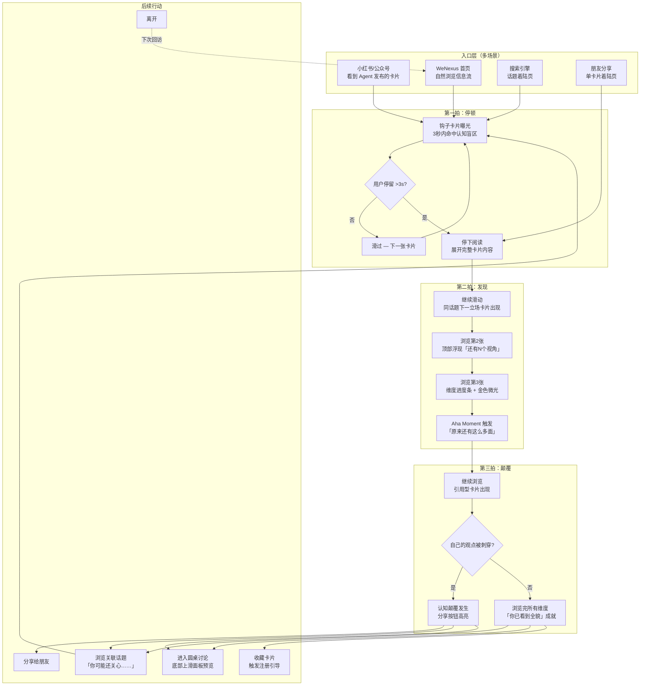
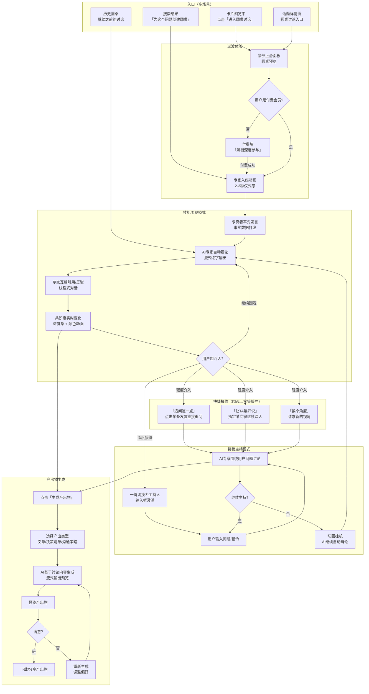
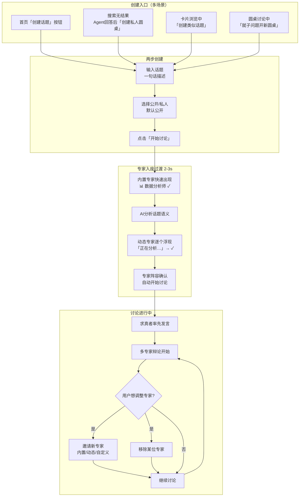
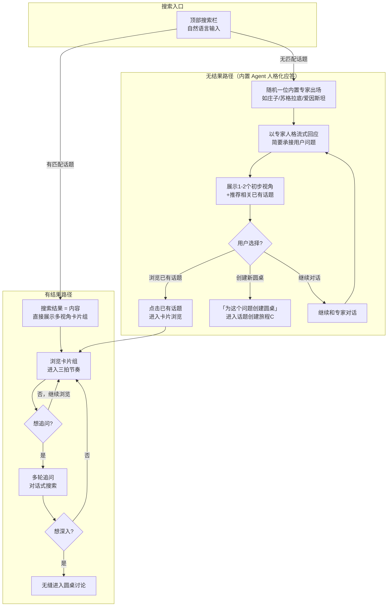

# UX Design Specification wenexus

**Author:** xiaohui
**Date:** 2026-03-15

---

## Executive Summary

### 产品愿景

WeNexus 是一个 AI 驱动的多元视角内容平台，核心信念是"复杂问题不存在简单答案"。通过结构化呈现不同立场的观点碰撞，让用户自己拼出事情的全貌。

产品采用双层内容架构：表层是小红书式观点卡片信息流，每张卡片鞭辟入里地击中认知盲区，制造"啊，原来如此"的认知惊喜；深层是 AI 专家圆桌讨论，求真者事实打底 + 多 AI 专家线程辩论，用户可挂机围观或接管主持，讨论成果一键转化为产出物。

### 目标用户

**主要用户：觉醒中的旁观者** — 面对争议话题时处于"被洗脑不自知 / 不舒服但说不清 / 搜过但只得到局部"状态的普通人。核心驱动力是自利："我不想被蒙在鼓里"。覆盖全生命周期议题（青年期→婚恋期→职场期→中年期→宏观层面）。

**进阶用户：积极的连接者** — 看到全貌后产生行动欲望的人。不仅想搞明白，还想用理解去修复关系、做决策、说服他人。通过圆桌讨论深度参与，生成可执行的产出物（沟通策略、决策清单等）。

**用户使用场景**：碎片时间刷观点卡片（移动端为主）；面对具体问题时进入圆桌讨论深度探索（移动端+桌面端）。

### 关键设计挑战

1. **双层体验的无缝过渡**：从轻量碎片化消费到深度沉浸式交互的自然引导，是产品转化漏斗的核心
2. **圆桌讨论的认知负荷管理**：多专家辩论、线程引用、模式切换、角色切换的功能密度极高，需渐进式揭示
3. **观点卡片的深度与轻量平衡**：长文本图文卡片需在保持内容深度的同时维持碎片化消费的轻松感
4. **"认知惊喜"的系统性设计**：北极星指标是情绪体验目标，需通过内容编排、视觉节奏、信息揭示顺序来制造
5. **移动端圆桌讨论的呈现**：多线程、多专家、操作台在小屏上的交互方案

### 设计机会

1. **渐进式揭示**：利用双层架构的深度层级，设计"钩子→展开→沉浸"的认知旅程
2. **情绪化数据可视化**：共识度、专家状态、关系线变化可成为极具感染力的实时视觉体验
3. **参与度连续体**：挂机围观→简单追问→接管主持→参与者发言，自然的参与度上升曲线
4. **产出物即传播载体**：在分享体验上做到极致精美，每一次分享都是增长

## Core User Experience

### 核心体验定义

**核心消费动作**：浏览观点卡片信息流 — 碎片化、高频、低认知负荷。

**核心价值动作**：在同一话题下看到 3+ 个不同立场的观点卡片 — 这是"认知惊喜"发生的时刻，是产品 Aha Moment 的触发点，是一切深度功能的入口。

**核心深度动作**：AI 专家圆桌讨论 — 挂机围观或接管主持，将多元理解转化为可执行的产出物。

**产品体验本质**：不是知识平台，不是社交平台，是"认知娱乐"。用户因为内容精彩而来，认知提升是自然发生的副产品。

### 平台策略

| 维度 | 策略 |
|------|------|
| 平台类型 | Web App（Next.js 15 App Router），响应式设计 |
| 设备优先级 | Mobile-first（观点卡片主要在手机端消费） |
| 输入方式 | 移动端触控为主，桌面端鼠标/键盘 |
| 桌面端优势 | 圆桌讨论多线程展示、操作台交互更丰富 |
| SEO | 观点卡片和话题页面 SSR/SSG，支持搜索引擎收录 |
| 部署 | Cloudflare Workers 边缘部署，全球低延迟 |
| 离线能力 | 不需要，产品本质是实时内容消费和 AI 交互 |

**多着陆场景差异化体验：**

| 着陆场景 | 用户来源 | 用户心理状态 | 第一屏设计 |
|---------|---------|------------|-----------|
| 信息流首页 | 自然浏览、回访用户 | 无明确目标，"随便看看" | 卡片瀑布流，按话题分类 Tab |
| 单卡片着陆页 | 分享回流（微信/小红书/朋友圈） | 被某个具体观点吸引 | 完整观点卡片 + "看看其他专家怎么说" CTA |
| 话题着陆页 | 搜索引擎、外部导流链接 | 带着具体问题来 | 话题概览 + 多视角卡片组 + 圆桌讨论入口 |

### 无摩擦交互

1. **卡片浏览链路**：刷卡片 → 被钩住 → 看同话题更多视角 — 全程零决策点、零等待
2. **挂机围观**：进入圆桌后 AI 专家自动辩论，用户无需任何操作即可获得完整价值
3. **外部导流**：从小红书/公众号点击进入 WeNexus，零学习成本直达内容
4. **产出物生成**：一键生成，无需配置参数或选择格式
5. **模式切换**：挂机↔接管、主持人↔参与者 — 一键切换，上下文完全保留
6. **搜索链路**：自然语言搜索 → 结果即内容 → 多轮追问 → 无缝进入圆桌讨论，全程不中断心流
7. **分享回流着陆**：朋友分享的卡片 → 点击即看完整观点 → 自然发现更多视角，无注册拦截

### 关键成功时刻

| 时刻 | 用户感受 | 设计目标 |
|------|---------|---------|
| 第一次看到意料之外的观点 | "这个说法我怎么没想到？" | 钩子卡片 3 秒内抓住注意力 |
| 同一话题下看到 3+ 不同立场 | "原来还有这么多面" | Aha Moment — 多视角浏览流畅自然 |
| 自己坚信的观点被意外角度刺穿 | "等等……我之前怎么没想到这一层" | **认知颠覆** — 比认知惊喜更强烈、更持久、更可能驱动分享 |
| 第一次进入圆桌讨论 | "他们在说我想问的" | 卡片→圆桌无缝过渡，内容立即有价值 |
| 围观专家互相反驳 | "比辩论赛还精彩" | 线程对话视觉有"现场感" |
| 接管后专家回应提问 | "他们真的在回答我" | 主持操作简单，AI 回应快速且相关 |
| 生成产出物 | "直接能用" | 产出物质量高到用户愿意分享 |
| 看完一个话题，发现关联话题 | "原来这件事和那件事有关系" | **未完成的理解** — 种下"还有一面没看到"的好奇心 |

### 体验原则

1. **钩子优先（Hook First）**：每个触点都以最具冲击力的信息先入 — 卡片的第一句话、圆桌的第一个观点、产出物的第一段，都要让人停下来
2. **零门槛深入（Zero-Barrier Deepening）**：从浅到深的每一步都不要求用户做决定或学习新概念 — 想看更多就看更多，不需要注册、选择或理解产品结构
3. **围观即价值（Spectating is Valuable）**：90%+ 用户的主要体验是纯围观。挂机模式不是简化版的主持体验，而是独立设计的、专门优化的第一等体验 — 围观的信息架构、视觉节奏、内容密度都应该针对"不操作的观众"独立设计
4. **认知惊喜驱动（Surprise-Driven）**：所有交互设计的检验标准 — 这个交互是否有可能让用户产生"啊，原来如此"？如果不能，重新设计
5. **未完成的理解（Unfinished Understanding）**：每次体验都在用户心中种下"还有一面我没看到"的感觉 — 话题关联、维度提示、"你可能还关心"的引导。不是 cliffhanger 的刻意吊胃口，而是真诚揭示复杂性，驱动自然回访

### 付费墙过渡体验

**设计原则**：付费墙不是一堵墙，而是一个"自然升级的邀请"。

| 阶段 | 免费用户可见 | 付费触发点 |
|------|-----------|-----------|
| 观点卡片浏览 | 完整可见，无限浏览 | 无 |
| 圆桌讨论围观 | 可预览摘要或精彩片段（FR23） | "想看完整讨论？" |
| 交互式圆桌（接管/主持） | 不可用 | 付费解锁 |
| 产出物生成 | 不可用 | 付费解锁 |

**体验要求**：免费用户在付费墙前已经获得了足够的价值（看到了全貌），付费解锁的是"深度参与和个性化产出"。用户付费的动机是"我要用这个理解去做点什么"，而不是"我被挡在了门外"。

### 移动端圆桌策略

**核心决策**：移动端圆桌体验采用"对话流"模式，而非桌面端的圆形布局。

| 维度 | 桌面端 | 移动端 |
|------|-------|-------|
| 布局 | 圆形布局（专家头像围成一圈） | 线性对话流（类 iMessage 群聊） |
| 专家状态 | 头像边框颜色 + 动画 + 位置变化 | 头像气泡 + 状态标签 |
| 操作台 | 底部完整操作栏 | 底部精简操作 + 长按/滑动手势 |
| 线程引用 | 引用块 + 连线展示 | 引用卡片折叠展示 |
| 共识度 | 仪表盘 + 专家位置动画 | 顶部进度条 + 文字提示 |

这不是桌面端的降级版，而是针对移动场景的最优解 — 利用用户已有的聊天软件心智模型，降低认知负荷。

## Desired Emotional Response

### 主要情感目标

**核心情感："啊，原来如此"的认知发现感**

WeNexus 的核心情感体验不是被教育，不是被说服，而是**自己发现了之前没看到的面**。这种自主发现带来的认知快感是产品最强的留存和传播驱动力。

**支撑情感：**

- **好奇心** — "还有什么我不知道的？" — 驱动持续探索
- **安全感** — "这个平台没有在操控我" — 建立信任
- **自主感** — "我自己得出了结论" — 尊重用户智识
- **掌控感** — "我随时可以接管" — 降低使用焦虑
- **智识快感** — "我比昨天更懂了" — 价值感

**需要避免的情感：**

- 被说教感、被操控感、信息焦虑、智力压迫、失控感

### 情感旅程映射

| 阶段 | 触点 | 期望情感 | 需避免 |
|------|------|---------|-------|
| 发现 | 钩子卡片第一眼 | 意外停顿 — "等等，这个说法……" | 无感滑过、标题党既视感 |
| 消费 | 同话题多视角 | 认知扩展的快感 — "我之前只看到了一面" | 信息过载、被灌输感 |
| 颠覆 | 信念被新角度刺穿 | 安全的认知震荡 — 视野打开 | 被冒犯、平台有偏见 |
| 注册 | 想保存/收藏发现 | "我想留住这个发现" — 自发的保存欲 | 被迫注册、流程打断心流 |
| 深入 | 围观专家辩论 | 观赛般的兴奋 — 智力娱乐 | 无聊、对话空洞 |
| 掌控 | 接管主持 | 被听见的满足感 | 操作复杂的挫败 |
| 付费 | 解锁深度参与 | "我要用理解去行动" — 行动欲驱动 | "我被挡在门外" — 被限制感 |
| 收获 | 生成产出物 | 即时效用感 — "直接能用" | 质量差的失望 |
| 离开 | 关闭后 | 未完成的好奇 — "还想继续看" | 遗忘、无召回理由 |
| 分享 | 发给朋友 | 发现者的兴奋 — "让你也看看这个你没看到的角度" | 不好意思分享 |

### 微情感设计

| 正面（追求） | 负面（避免） | 设计含义 |
|-------------|------------|---------|
| 好奇心 | 信息焦虑 | 信息量渐进式揭示，不一次性倒出 |
| 安全感 | 被操控感 | 多视角并列呈现，不给结论，不排序偏好 |
| 自主感 | 被说教感 | 用户是发现者，不是被教育者 |
| 智识快感 | 智力压迫 | 语言平易，观点深刻但表述不学术 |
| 掌控感 | 失控感 | 挂机模式也要让用户感到可随时接管 |
| 信任 | 怀疑 | 求真者事实打底 + 来源标注 |

### "未完成的好奇"触发器设计

用户离开后的回访欲不会自然发生，需要具体的 UX 触发机制：

| 触发器 | 出现场景 | 情感作用 |
|-------|---------|---------|
| "这个话题还有 3 个你没看到的维度" | 话题卡片末尾 | 揭示还有更多面，激发好奇 |
| "讨论还在继续…… 2 位专家有新发言" | 离开圆桌时 | 制造"错过了什么"的感觉 |
| "如果你对'彩礼'感兴趣，'原生家庭'可能会颠覆你另一个认知" | 关联话题推荐 | 拓展认知领域，种下新的探索种子 |
| 通知/推送中的观点预告 | 用户非活跃期 | 用内容本身召回，而非营销话术 |

### 信任建立阶梯

信任是脆弱的情感 — 一次崩塌需要十次重建。WeNexus 需要系统性地在每个阶段建立信任：

| 阶段 | 信任来源 | 设计手段 |
|------|---------|---------|
| 卡片首次浏览 | 内容质量本身 | 观点犀利 + 数据有据可查 + 语言不浮夸 |
| 多卡片对比 | 公平性感知 | 不同立场的卡片质量一致、篇幅均衡 |
| 进入圆桌 | 事实验证 | 求真者先做 fact check，来源可点击 |
| 深度参与 | 响应质量 | AI 回应准确切题，不答非所问 |
| 长期使用 | 品牌积累 | 多次体验的一致性建立"WeNexus 靠谱"的心智 |

### 情感修复策略

针对高概率的"情感失败点"，预设具体的 UX 修复方案：

| 失败场景 | 用户情感 | 修复策略 |
|---------|---------|---------|
| AI 生成了空洞/重复内容 | 信任崩塌、"这就是 AI 编的" | 让其他专家指出"这个论点不够充分"（把质量问题变成辩论的一部分，而非系统的 bug） |
| 用户对某个观点感到被冒犯 | 被攻击感、平台有偏见 | 每个挑战性观点前加"从 XX 角度来看"框架前缀 — 明确这是一个视角，不是在否定用户 |
| 搜索无结果（MVP 话题有限） | 期待落空、失望 | 不展示空白，而是"我们还没有这个话题，但以下 3 个相关话题可能包含你想了解的维度" |
| 圆桌讨论中 AI 响应慢 | 焦虑、怀疑是否卡住 | 专家"思考中"状态动画 + 其他专家的"旁白/小动作"填充等待时间 |
| 产出物质量不及预期 | 失望、"浪费了时间" | 提供"重新生成"+ 简单的偏好调整（更详细/更简洁/换个角度） |

### 情感差异化

| 竞品 | 竞品给的感受 | WeNexus 给的感受 |
|------|------------|----------------|
| 知乎/B站 | "我学到了"（被教育） | "我发现了"（自主发现） |
| ChatGPT | "问题解决了"（工具感） | "世界变复杂了"（认知扩展） |
| 微博 | "我是对的"（确认偏见） | "对方也有道理"（视角开放） |
| 播客 | "听完了"（被动接收） | "还想继续探索"（主动探索） |

### 情感设计原则

1. **发现感优于学习感**：用户是探险者，不是学生。每个交互让用户感到"我自己发现了"，而不是"系统教了我"
2. **安全的认知冲击**：挑战既有认知时，体验是安全的、被尊重的 — "还有一个角度你可能没想到"，而不是"你错了"
3. **节制的信息密度**：认知惊喜需要留白。每次只揭示恰到好处的信息量，让用户有消化时间
4. **掌控感贯穿始终**：即使挂机围观，用户也要感到"我可以随时接管" — 潜在掌控感是安全感的来源
5. **分享即自我表达**：分享不是"推荐好内容"，而是"展示我发现了这个视角" — 分享行为是用户智识身份的表达
6. **信任是基础设施**：从内容质量到事实验证到品牌一致性，信任需要在每个阶段系统性建立，并为失败点预设修复方案

## UX Pattern Analysis & Inspiration

### 参考产品分析

**小红书 — 卡片消费体验标杆**

- 图文卡片视觉密度极高但不累，瀑布流无限滚动零摩擦
- 标题+封面图的组合在 0.5 秒内传达内容价值
- "滑动→停顿→点击→消费→返回"的循环几乎无认知成本
- **WeNexus 借鉴**：卡片信息流的基础交互范式、"3 秒内被钩住"的呈现密度

**ChatGPT/Claude — AI 对话心智模型**

- 对话式交互零学习成本，流式输出让等待可接受
- **不足**：单一视角、刻意中立、长对话找不到重点
- **WeNexus 差异**：同样的对话范式，但"一个 AI 回答"变成"多个 AI 辩论"

**Bilibili 弹幕/直播 — "围观即参与"设计**

- 弹幕让围观者感到自己是社区一部分
- 观众参与度是连续的（纯围观→弹幕→送礼物）
- **核心洞察**：围观的快感来自"看到别人的反应"，不仅仅是内容本身
- **WeNexus 借鉴**：圆桌围观时展示匿名态度投票等社交存在感信号

**Twitter/X Threads — 线程对话信息架构**

- 线程回复清晰展示对话脉络，引用让碰撞可追溯
- **不足**：深层嵌套导致迷失，分支过多无法理清主线
- **WeNexus 借鉴**：线程基本范式，但限制嵌套深度 — 有主持人引导的结构化对话

**即刻/播客 — 深度内容消费**

- 即刻的圈子让用户找到同频人群，播客创造陪伴感
- **不足**：即刻信息密度不够，播客 90 分钟只得 3-4 个观点
- **WeNexus 差异**：卡片形式实现播客级信息深度 + 碎片化消费效率

**Midjourney — AI 参数选择的掌控感**

- 用户在生成前调整参数，感觉自己在"指挥"AI
- **WeNexus 借鉴**：话题创建时的专家选择给用户"组建圆桌"的掌控感

### 可迁移 UX 模式

**导航与信息架构**

| 来源 | 模式 | WeNexus 应用场景 |
|------|------|----------------|
| 小红书 | 双列瀑布流 | 观点卡片首页信息流 |
| Twitter | 线程对话+引用 | 圆桌讨论引用/回应结构（限制嵌套深度） |
| 即刻 | 话题广场 | 话题分类与发现页面 |

**交互模式**

| 来源 | 模式 | WeNexus 应用场景 |
|------|------|----------------|
| ChatGPT | 流式输出 | AI 专家回复逐字流式呈现 |
| B站直播 | 无操作围观有价值 | 圆桌讨论挂机模式 |
| 小红书 | 收藏夹 | "保存发现"作为注册驱动力 |
| 抖音 | 全屏沉浸滑动 | 移动端卡片全屏沉浸式浏览（可选） |
| Midjourney | AI 生成前参数选择 | 话题创建时的专家阵容选择（高级路径） |

**视觉模式**

| 来源 | 模式 | WeNexus 应用场景 |
|------|------|----------------|
| 小红书 | 卡片视觉层次 | 钩子句+核心数据+专家头像 |
| ChatGPT | Markdown 渲染 | 圆桌讨论结构化内容呈现 |
| Notion | 排版质感 | 产出物（报告/文章/清单）视觉品质 |

### 话题创建的圆桌组建体验

**设计哲学："零摩擦创建 + 仪式感启动"**

话题创建不是"填表单"，而是"我有个问题想搞明白"。用户在此刻耐心极低、行动欲极高，每多一个选择步骤都在消耗行动欲。

**两步创建流程（取代七步流程）：**

| 步骤 | 用户操作 | 系统行为 |
|------|---------|---------|
| 1. 输入话题 | 一句话描述 + 公开/私人选择（默认公开） | 无 |
| 2. 一键开始 | 点击"开始讨论" | AI 分析话题 → 推荐专家 → 启动讨论 |

专家选择、产出类型选择全部后置到讨论进行中。

**"专家入座"过渡动画（2-3 秒）：**

点击"开始讨论"后，等待时间变成仪式感体验：

```
用户点击"开始讨论"
        ↓
┌─────────────────────────────────┐
│ 正在为你组建专家圆桌...          │
│                                 │
│  [内置专家快速出现]              │  ← 0 延迟
│  📊 数据分析师 ✓                │
│                                 │
│  [动态专家逐个浮现]              │  ← 流式推送
│  👔 HR 总监 正在分析...          │
│  🎯 猎头顾问 正在分析...         │
│                                 │
│  专家阵容确认 → 自动开始讨论     │
└─────────────────────────────────┘
        ↓
求真者率先发言，讨论正式开始
```

用户不需要做任何选择，但看到了专家是谁 — 这是第一次直观感受多 Agent 特性的时刻。

**两类 Agent：**

| 类型 | 特点 | 标签 | MVP 约束 |
|------|------|------|---------|
| 内置专家 | 预设人格/头像/风格，质量稳定 | "经典视角" | 持久化，跨话题复用 |
| 动态专家 | AI 根据话题语义生成，高度相关 | "为此话题生成" | 仅当次有效，不持久化 |

**专家数量限制**：MVP 阶段 3-5 人（技术约束：每增一个 Agent 增一次 API 调用/轮）。

**讨论中调整（后置操作）：**

- 邀请新专家（内置/动态/自定义）— 对应 US-17/19
- 移除专家 — 对应 US-18
- 选择产出类型 — 对应 US-12

**多场景创建入口：**

| 场景 | 入口设计 | 用户心理 |
|------|---------|---------|
| 首页 | 顶部"创建话题"按钮 | 主动探索 |
| 搜索无结果 | "没有匹配 — [为这个问题创建私人圆桌]" | 问题驱动 |
| 卡片浏览中 | "创建类似话题"浮动按钮 | 关联好奇 |
| 圆桌讨论中 | "就这个子问题开新圆桌" | 深度延伸 |

**高级用户路径（可选）：**

老用户可展开"高级设置"，在创建时预选专家和产出类型。但这是可选路径，不是必经之路。

### 需避免的反模式

| 反模式 | 为什么不适合 WeNexus |
|-------|-------------------|
| 无限嵌套评论（Reddit） | 圆桌需要主线清晰，不能变成无组织评论区 |
| 算法排序偏见（微博/头条） | 不能按"你可能喜欢的立场"排序，会强化信息茧房 |
| 强制注册才能浏览 | 与"零门槛深入"原则冲突 |
| AI 单一"正确答案"（ChatGPT） | 任何环节都不能暗示"这是正确答案" |
| 信息流无限下拉无组织（抖音） | 卡片需话题维度组织，不是纯推荐流 |
| 复杂操作教程（企业工具） | 圆桌操作必须自解释，不依赖教学 |
| 创建前多步骤配置（企业工具） | 创建流程两步完成，配置后置到讨论中 |

### 设计灵感策略

**直接采用：**

- 小红书式卡片瀑布流（首页信息流核心范式）
- ChatGPT 流式输出（AI 专家回复呈现方式）
- 线程式引用回复（圆桌讨论对话结构）

**适配改造：**

- B站围观体验 → "无弹幕但有共识度实时变化"的围观反馈
- 小红书分享 → "观点卡片+品牌水印+导流链接"的分享载体
- 播客深度内容 → "卡片组"形式，保持深度但缩短单位消费时间
- 视频会议邀请界面 → "专家入座"的圆桌组建过渡动画

**明确拒绝：**

- 算法驱动个性化排序（MVP 不做，且与价值观冲突）
- 评论/点赞/UGC 互动（MVP 不做，避免低质量内容）
- Gamification 积分体系（暂不做，专注内容价值本身）
- 创建前强制多步骤配置（与零门槛原则冲突）

## Design System Foundation

### 设计系统选择

**方案：Headless UI (Radix UI) + TailwindCSS 4 自定义设计**

WeNexus 已选定 Radix UI + TailwindCSS 4 + Framer Motion 的技术基础。这是"无头组件 + 自定义视觉"策略：Radix UI 提供组件逻辑和可访问性保障，TailwindCSS 提供完全自定义的视觉层，Framer Motion 提供动画能力。

### 选择理由

1. **视觉完全自主**：Radix UI 是 Headless UI，不强制任何视觉风格，WeNexus 可以建立独特的品牌视觉
2. **可访问性内置**：Radix UI 原子组件内置 ARIA 属性、键盘导航、焦点管理
3. **开发效率**：TailwindCSS 4 实用类方式加速 UI 开发，prettier 插件自动排序
4. **动画精细控制**：Framer Motion 声明式动画 API，适合关键动画场景
5. **Server Components 兼容**：Radix UI + TailwindCSS 与 React 19 Server Components 兼容良好

### 视觉设计语言

**调性定位："精致的智识感"** — 像一本装帧精美的杂志，内容深刻但呈现优雅。追求的是克制、温度与材质感的组合。

**质感来源：**

- 参考 Monocle 杂志（深炭灰+奶白+极少暖色点缀）、Aesop（暖棕+奶油色）、Apple 产品页（大量留白+精确亮色）
- 底色不是纯白 — 微暖的 off-white 让界面从"屏幕"变成"纸面"
- 深色不是纯黑 — 带暖底的深灰比 `#000000` 高级十倍
- 强调色极度克制 — 金色只在"认知惊喜"时刻出现，像一本书中的烫金标题
- 色彩饱和度整体偏低 — 所有颜色像调过色的胶片，而非数码感的高饱和

**色彩 Token 体系：**

| Token | 亮色模式 | 暗色模式 | 用途 |
|-------|---------|---------|------|
| Surface | 暖灰白 `#FAFAF8` | 深暖灰 `#1C1C1E` | 页面底色 |
| Surface-raised | 纯白 `#FFFFFF` | 微亮灰 `#2C2C2E` | 卡片、面板 |
| Text-primary | 炭墨 `#1D1D1F` | 暖白 `#F5F5F3` | 主要文字 |
| Text-secondary | 中灰 `#6E6E73` | 中灰 `#98989D` | 辅助文字 |
| Brand | 深青/墨绿 `#1A3A3A` | 亮青 `#3A7A7A` | 品牌元素、链接 |
| Accent | 哑光金 `#B8860B` | 亮金 `#D4A843` | 认知惊喜高光、重要 CTA |
| Border | 淡灰 `#E5E5E3` | 深灰 `#3A3A3C` | 分隔线、边框 |
| Success | 翡翠绿 `#2D6A4F` | 亮翠 `#52B788` | 共识形成、正面反馈 |
| Warning | 哑光琥珀 `#B07D2B` | 亮琥珀 `#D4A843` | 分歧加剧、需注意 |
| Danger | 深珊瑚 `#9B2C2C` | 亮珊瑚 `#E57373` | 错误、破坏性操作 |

**排版系统：**

| 元素 | 规格 |
|------|------|
| 字体栈 | -apple-system, PingFang SC, Microsoft YaHei（系统字体，性能优先） |
| 正文基准 | 16px，行高 1.6-1.8（长文本阅读舒适） |
| 卡片钩子文案 | 20-24px 加粗，核心注意力抓取 |
| 专家引用 | 斜体 + 左边框引用块，边框用 Brand 色 |
| 间距系统 | 4px 基准（4/8/12/16/24/32/48/64） |
| 圆角 | 组件 8px，卡片 12px，模态框 16px |

**动画规范：**

| 场景 | 动画类型 | 时长 | 原则 |
|------|---------|------|------|
| 专家入座 | 淡入 + 缩放 | 300-500ms | 仪式感，每个专家间隔 200ms |
| 共识度变化 | 数值滚动 + 颜色渐变 | 600ms | 信息反馈，吸引注意 |
| 卡片翻转/展开 | 缩放 + 位移 | 250ms | 流畅自然，不阻塞操作 |
| 专家状态变化 | 边框颜色渐变 | 200ms | 即时反馈，不分散注意力 |
| 页面切换 | 淡入淡出 | 150ms | 快速，不让用户等 |
| 加载占位 | 骨架屏脉冲 | 循环 | 减少感知等待时间 |

**总原则**：动画克制但精准。只在关键体验时刻使用动画，日常交互追求即时响应。

**暗色模式：**

- MVP 阶段支持 — 碎片时间消费场景（深夜刷手机）暗色模式是刚需
- TailwindCSS 4 `dark:` 变体实现，Token 已定义明/暗两套色值
- 暗色底色是深暖灰 `#1C1C1E` 而非纯黑，文字是暖白 `#F5F5F3` 而非纯白
- 默认跟随系统设置，用户可手动切换

### 业务组件策略

基于 Radix UI 原子组件封装的 WeNexus 业务组件：

| 组件 | 基础 | 业务定制 |
|------|------|---------|
| TopicCard | Radix Card | 钩子文案 + 专家头像 + 数据指标 |
| ExpertAvatar | Radix Avatar | 状态边框 + 动画 + 点击菜单 |
| RoundtableThread | 自定义 | 线程对话 + 引用块 + 折叠 |
| ConsensusGauge | 自定义 | 实时进度 + 颜色动画 + 文字提示 |
| ControlPanel | Radix Toolbar | 操作按钮组 + 输入框 + 模式切换 |
| ExpertSelector | Radix Select + Card | 内置/动态专家选择 + 预览卡片 |
| OutputPanel | Radix Tabs + Card | 多产出类型切换 + 预览 + 导出 |

## Defining Core Experience

### 定义体验：三拍节奏

**一句话定义**：「刷到一个让你停下来的观点，发现同一个问题还有你完全没想到的角度，然后你一直坚信的那个看法被刺穿了。」

这就是 WeNexus 的核心体验——如果这三拍做对了，其他一切水到渠成。

**三拍节奏详解：**

| 拍 | 用户体验 | 情感 | 设计目标 |
|---|---------|------|---------|
| 第一拍：停顿 | 刷信息流时被一张卡片的钩子句拦住 | 意外——「等等，这个说法……」 | 3 秒内抓住注意力，钩子句命中认知盲区 |
| 第二拍：发现 | 在同一信息流中连续滑动，看到同话题 3+ 个不同立场 | 扩展——「原来还有这么多面」 | Aha Moment 触发，零跳转零摩擦的多视角浏览 |
| 第三拍：颠覆 | 自己坚信的观点被一个意料之外的角度刺穿 | 震荡——「我之前怎么没想到这一层」 | 认知升级的顶峰时刻，最强分享驱动力 |

**为什么是三拍而不是两拍**：第一、二拍让用户发现「世界比我想的复杂」，这是认知惊喜；第三拍让用户发现「我自己也是局部的」，这是认知颠覆。前者驱动好奇心，后者驱动分享和回访——因为被颠覆过一次的人会开始怀疑自己在其他话题上是否也只看到了局部。

### 用户心智模型

**心智模型转变**：从「找答案」到「看全貌」

用户带着现有平台培养的心智模型来到 WeNexus：

| 阶段 | 用户心智 | WeNexus 的引导 |
|------|---------|---------------|
| 进入前 | 「我要找到正确答案」（知乎/ChatGPT 模式） | — |
| 第一拍后 | 「这个观点很有道理」（单一视角接受） | 信息流自然呈现下一张不同立场卡片 |
| 第二拍后 | 「等等，对方也有道理……」（认知冲突） | 多视角并列呈现，不给结论，不排序 |
| 第三拍后 | 「原来我之前只看到了一面」（心智转变） | 维度进度提示 + 关联话题引导 |
| 长期 | 「面对争议，先看全貌」（新心智模型） | WeNexus 成为面对争议话题的第一反应 |

**关键心智模型设计**：

- **不给结论**：与知乎/ChatGPT 的「给你答案」不同，WeNexus 呈现多个面，让用户自己判断
- **不排序偏好**：不同立场的卡片质量一致、篇幅均衡，不暗示哪个「更对」
- **发现者身份**：用户是「发现全貌的探险者」，不是「被教育的学生」

**心智转变衡量指标**：用户首次主动切换到不同立场卡片的比率——代表从「确认偏见」模式切换到「探索全貌」模式。

### 成功标准

核心定义体验的成功直接对齐 PRD 北极星指标——**认知惊喜率**。

| 指标 | 定义 | 目标 | 对应的拍 |
|------|------|------|---------|
| 钩子停留率 | 卡片曝光后用户停留 >3s 的比率 | > 30% | 第一拍 |
| 多视角发现率 | 同话题浏览 3+ 不同立场卡片的比率 | > 40% | 第二拍 |
| 主动切换立场率 | 用户主动点击/滑动到不同立场卡片的比率 | > 25% | 第二→三拍 |
| 认知颠覆分享率 | 浏览 3+ 立场后触发分享的比率 | > 8% | 第三拍 |
| Aha Moment 触发率 | = 多视角发现率（PRD 定义的激活门槛） | > 40% | 整体 |

**Aha Moment 定义**（与 PRD 对齐）：用户首次在同一话题下浏览 3+ 个不同立场的观点卡片。

### 模式分析

**策略：熟悉模式的创新组合**

WeNexus 的核心定义体验不需要用户学习全新的交互范式，而是将多个用户已熟悉的模式以创新方式组合：

| 熟悉模式 | 来源 | WeNexus 的创新组合 |
|---------|------|-------------------|
| 卡片信息流滑动 | 小红书/抖音 | 同话题多立场卡片在同一流中连续出现 |
| 长文本图文阅读 | 公众号/即刻 | 卡片内融合数据、引用、专家头像的结构化深度内容 |
| 标签/分类浏览 | 小红书/即刻 | 按生命阶段和话题维度组织，不是算法推荐 |
| 流式 AI 对话 | ChatGPT/Claude | 多个 AI 专家同时辩论，而非单一 AI 回答 |

**创新点**：用户不需要学习新交互（降低门槛），但组合方式前所未有（制造惊喜）。核心创新是**「同一信息流中的观点碰撞」**——用户以为在刷信息流，实际上在经历结构化的认知旅程。

**无需用户教育的原因**：

- 滑动浏览 = 小红书心智模型
- 多张卡片 = 公众号长文心智模型
- 不同头像不同观点 = 微博/论坛心智模型
- 所有这些的组合 = 全新的「看全貌」体验

### 体验机制

**核心交互四步流：**

**1. 启动（Initiation）**

| 场景 | 触发方式 | 系统行为 |
|------|---------|---------|
| 信息流浏览 | 用户滑动信息流 | 钩子卡片出现，3 秒内命中认知盲区 |
| 外部导流 | 点击小红书/公众号链接 | 直达完整观点卡片，底部「看看其他专家怎么说」 |
| 搜索 | 自然语言输入话题 | 搜索结果即内容，直接展示多视角卡片组 |
| 话题着陆 | 搜索引擎/外部链接 | 话题概览 + 多视角卡片组 + 圆桌入口 |

**预加载策略**：用户在某张卡片停留 >2s 时，系统预取该话题下其他立场的卡片数据，确保滑动到下一张时零等待。

**2. 交互（Interaction）**

| 动作 | 用户操作 | 系统响应 |
|------|---------|---------|
| 浏览钩子 | 在信息流中自然滑动 | 钩子卡片全屏呈现，钩子句 20-24px 加粗 |
| 深入阅读 | 继续滑动/展开卡片 | 完整长文本图文内容渐进揭示 |
| 发现多视角 | 继续滑动 | 同话题下一立场卡片自然出现，专家头像和立场标签醒目 |
| 对比立场 | 连续浏览多张同话题卡片 | 维度进度提示浮现：「你已看到 3/6 个维度」 |
| 深度探索 | 点击「进入圆桌讨论」 | 过渡动画：底部上滑面板展示圆桌预览 → 确认后全屏进入 |

**关键交互原则**：全程零跳转。从钩子到多视角到圆桌入口，所有内容在同一上下文中流动展开。

**3. 反馈（Feedback）**

| 时机 | 反馈形式 | 目的 |
|------|---------|------|
| 浏览第 2 张同话题卡片 | 顶部浮现「还有 N 个视角」提示 | 揭示还有更多面，激发好奇 |
| 浏览第 3 张（Aha Moment） | 维度进度条出现 + 哑光金微光动画 | 标记认知惊喜时刻 |
| 认知颠覆时刻 | 分享按钮视觉高亮（Brand 色微妙脉冲） | 低摩擦分享入口，不打断阅读 |
| 浏览全部维度 | 「你已看到这个话题的全貌」成就提示 | 完成感 + 关联话题推荐 |
| 离开话题 | 「这个话题还有 N 个你没看到的维度」 | 「未完成的好奇」驱动回访 |

**4. 完成（Completion）**

| 完成状态 | 用户感受 | 后续引导 |
|---------|---------|---------|
| 看完一组多视角卡片 | 「原来这件事这么复杂」 | 维度完成度 + 「还想了解更多？进入圆桌讨论」 |
| 认知颠覆发生 | 「我之前只看到了一面」 | 分享入口高亮 + 关联话题「你可能还关心……」 |
| 进入圆桌讨论 | 「我要深入了解」 | 底部上滑面板预览 → 圆桌组建仪式感过渡 |
| 离开平台 | 「还有一面没看到」 | 下次回访时，继续未完成的话题探索 |

**卡片→圆桌过渡设计**：采用**底部上滑面板**形式。用户点击「进入圆桌讨论」后，面板从底部滑出展示圆桌预览（话题摘要 + 参与专家 + 精彩片段），确认后全屏展开进入实时圆桌。这避免了 SSR 静态页面到 WebSocket 实时页面的突兀跳转，给系统建立 WebSocket 连接提供了缓冲时间。

## Visual Design Foundation

### 色彩系统深化

**品牌色彩哲学**：「精致的智识感」— 所有颜色像调过色的胶片，低饱和度、带暖底、极度克制。金色只在认知惊喜时刻出现。

**语义化色彩映射（基于 Design System Foundation Token 体系）：**

| 语义角色 | Token | 亮色值 | 暗色值 | 使用场景 | 对比度要求 |
|---------|-------|--------|--------|---------|-----------|
| 页面底色 | `--surface` | `#FAFAF8` | `#1C1C1E` | body 背景 | — |
| 卡片/面板 | `--surface-raised` | `#FFFFFF` | `#2C2C2E` | Card, Dialog, Sheet | 与 surface 区分度 ≥ 0.5 |
| 主文字 | `--text-primary` | `#1D1D1F` | `#F5F5F3` | 正文、标题 | ≥ 7:1（AAA） |
| 辅助文字 | `--text-secondary` | `#6E6E73` | `#98989D` | 时间戳、标签、说明 | ≥ 4.5:1（AA） |
| 品牌色 | `--brand` | `#1A3A3A` | `#3A7A7A` | 链接、品牌元素、专家引用边框 | ≥ 4.5:1 |
| 强调色 | `--accent` | `#B8860B` | `#D4A843` | 认知惊喜高光、核心 CTA | ≥ 3:1（大文本） |
| 分隔线 | `--border` | `#E5E5E3` | `#3A3A3C` | 卡片边框、分隔线 | — |
| 成功 | `--success` | `#2D6A4F` | `#52B788` | 共识形成、验证通过 | ≥ 4.5:1 |
| 警告 | `--warning` | `#B07D2B` | `#D4A843` | 分歧加剧 | ≥ 3:1 |
| 危险 | `--danger` | `#9B2C2C` | `#E57373` | 错误、破坏性操作 | ≥ 4.5:1 |

**专家立场色彩系统：**

圆桌讨论中不同专家需要视觉区分，但不能喧宾夺主：

| 用途 | 策略 | 实现 |
|------|------|------|
| 专家头像边框 | 每位专家分配一个低饱和度标识色 | `hsl(H, 30%, 55%)` — 色相 H 按专家序号均匀分布 |
| 发言气泡 | 微弱背景色区分 | 专家标识色 5% opacity 叠加在 surface-raised 上 |
| 引用回复连线 | 品牌色变体 | `--brand` 20% opacity |

**色彩过渡规范：**

| 场景 | 过渡方式 | 时长 |
|------|---------|------|
| 暗色模式切换 | 全局 CSS transition | 300ms ease-in-out |
| 共识度变化 | 颜色插值动画 | 600ms |
| 专家状态变化 | 边框色渐变 | 200ms |
| Hover 状态 | opacity 变化 | 150ms |

### 排版系统深化

**字号阶梯（基于 16px 基准，Major Third 比例 1.25）：**

| 级别 | 字号 | 行高 | 字重 | 用途 |
|------|------|------|------|------|
| Display | 32px | 1.2 | 700 | 话题标题（着陆页） |
| H1 | 28px | 1.3 | 700 | 页面标题 |
| H2 | 24px | 1.35 | 600 | 卡片钩子文案、区块标题 |
| H3 | 20px | 1.4 | 600 | 子标题、专家姓名 |
| Body-lg | 18px | 1.7 | 400 | 长文本阅读（卡片正文） |
| Body | 16px | 1.6 | 400 | 常规正文、圆桌对话 |
| Body-sm | 14px | 1.5 | 400 | 辅助信息、时间戳 |
| Caption | 12px | 1.4 | 500 | 标签、徽章、最小文字 |

**移动端字号适配：**

| 级别 | 桌面端 | 移动端 | 适配方式 |
|------|--------|--------|---------|
| Display | 32px | 26px | `clamp(26px, 4vw, 32px)` |
| H1 | 28px | 24px | `clamp(24px, 3.5vw, 28px)` |
| H2 | 24px | 20px | `clamp(20px, 3vw, 24px)` |
| Body-lg | 18px | 17px | 移动端阅读最低 17px |
| Body | 16px | 16px | 不缩小 |

**特殊排版元素：**

| 元素 | 规格 | TailwindCSS 实现参考 |
|------|------|---------------------|
| 钩子文案 | H2 加粗，首行缩进 0 | `text-2xl font-semibold` |
| 专家引用块 | Body 斜体 + 左边框 4px Brand 色 | `border-l-4 border-brand italic pl-4` |
| 数据高亮 | Body-lg 加粗 + Accent 色 | `text-lg font-bold text-accent` |
| 标签/立场标识 | Caption 大写 + 圆角背景 | `text-xs font-medium uppercase px-2 py-0.5 rounded-full` |

### 间距与布局系统

**间距基准：4px（与 TailwindCSS 4 默认对齐）**

| Token | 值 | TailwindCSS | 典型用途 |
|-------|-----|-------------|---------|
| `--space-1` | 4px | `p-1` | 图标与文字间距 |
| `--space-2` | 8px | `p-2` | 紧凑元素内间距 |
| `--space-3` | 12px | `p-3` | 按钮内间距、标签间距 |
| `--space-4` | 16px | `p-4` | 卡片内间距（移动端） |
| `--space-6` | 24px | `p-6` | 卡片内间距（桌面端）、区块间距 |
| `--space-8` | 32px | `p-8` | 大区块间距 |
| `--space-12` | 48px | `p-12` | 页面区域分隔 |
| `--space-16` | 64px | `p-16` | 页面顶部/底部留白 |

**布局断点：**

| 断点 | 宽度 | 场景 | 布局策略 |
|------|------|------|---------|
| `sm` | 640px | 大屏手机 | 单列，卡片全宽 |
| `md` | 768px | 平板竖屏 | 单列/双列切换 |
| `lg` | 1024px | 平板横屏/小笔记本 | 双列瀑布流 |
| `xl` | 1280px | 桌面端 | 双列 + 侧边栏 |
| `2xl` | 1536px | 大屏桌面 | 内容最大宽度 1280px 居中 |

**核心页面布局规则：**

| 页面 | 移动端 | 桌面端 |
|------|--------|--------|
| 信息流首页 | 单列卡片流，全宽 | 双列瀑布流，最大宽度 1280px |
| 话题详情页 | 单列多视角卡片组 | 主内容区 + 右侧话题导航 |
| 圆桌讨论 | 线性对话流（iMessage 式） | 圆形布局 + 底部操作台 |
| 产出物页面 | 全宽阅读视图 | 居中阅读视图（max-width 720px） |

**圆角系统：**

| 元素 | 圆角 | TailwindCSS |
|------|------|-------------|
| 按钮 | 8px | `rounded-lg` |
| 卡片 | 12px | `rounded-xl` |
| 模态框/Sheet | 16px | `rounded-2xl` |
| 头像 | 50% | `rounded-full` |
| 标签/Badge | 9999px | `rounded-full` |

### 无障碍设计标准

| 维度 | 标准 | 实现方式 |
|------|------|---------|
| 色彩对比度 | WCAG AA（正文 4.5:1，大文本 3:1） | 色彩 Token 已验证对比度 |
| 最小触控目标 | 44x44px（移动端） | 按钮/链接最小尺寸保证 |
| 键盘导航 | 所有交互元素可 Tab 聚焦 | Radix UI 内置键盘导航支持 |
| 焦点指示 | 可见焦点环（Brand 色） | `focus-visible:ring-2 ring-brand` |
| 屏幕阅读器 | 语义化 HTML + ARIA 属性 | Radix UI 内置 ARIA 支持 |
| 减少动画 | 尊重 `prefers-reduced-motion` | Framer Motion `useReducedMotion()` |
| 字号可调 | 不使用固定 px 阻止用户缩放 | `clamp()` + `rem` 基准 |

## Design Direction Decision

### 探索过的设计方向

**方向 A：「数据仪表盘」风格**

- 高信息密度、数据驱动、可视化图表突出
- 适合分析工具，但与「认知娱乐」定位冲突
- 否决原因：太像工具，缺乏内容消费的轻松感

**方向 B：「社交媒体」风格**

- 鲜艳色彩、高饱和度、动效丰富、用户头像突出
- 适合 UGC 平台，但与「精致智识感」调性冲突
- 否决原因：容易做成廉价感，用户明确要求追求质感

**方向 C：「杂志编辑」风格** ← 选定方向

- 低饱和度、大量留白、排版驱动、内容至上
- 参考 Monocle 杂志 + Aesop + Apple 产品页的质感
- 选定原因：与「精致智识感」完美契合，内容深刻但呈现优雅

**方向 D：「深色沉浸」风格**

- 暗色为主、霓虹点缀、电影感
- 适合娱乐/游戏，但与多数用户的碎片时间场景（白天使用）冲突
- 部分采纳：暗色模式作为可选项保留，非默认方向

### 选定方向：「杂志编辑」— 精致的智识感

**一句话定义**：像一本装帧精美的杂志——内容深刻但呈现优雅，克制、温度与材质感的组合。

**视觉关键词**：

| 关键词 | 含义 | 视觉表达 |
|--------|------|---------|
| 克制 | 色彩少而精，动画只在关键时刻 | 低饱和色板 + 金色仅认知惊喜时出现 |
| 温度 | 不是冰冷的工具感，而是有温度的阅读体验 | 暖灰底色（非纯白）+ 系统字体的人文感 |
| 材质感 | 像纸张而非屏幕，像实体杂志而非网页 | 暖调阴影 + 圆角 + 边距呼吸感 |
| 深度 | 内容分层清晰，重要的信息视觉权重高 | 字号阶梯明确 + 钩子文案大号加粗 |
| 安全感 | 不操控、不偏向、公平呈现 | 不同立场卡片质量一致、视觉权重均衡 |

**核心视觉原则**：

1. **内容即界面**：UI 元素退到最后，内容本身是最大的视觉元素。没有不必要的装饰、图标或分隔线
2. **留白是信息**：留白不是「没东西」，是给认知惊喜留的消化空间。段间距、卡片间距、页面边距都要充裕
3. **金色是奖励**：Accent 色（哑光金）只在认知惊喜时刻出现——Aha Moment 的维度进度条、核心 CTA 按钮、分享高亮。克制使用让每次出现都有仪式感
4. **暗色是尊重**：暗色模式不是简单反色，而是独立调校的阅读体验——深夜刷手机时的护眼舒适感

### 设计理由

| 维度 | 选择理由 |
|------|---------|
| 品牌定位 | 「精致智识感」需要视觉上的克制和品质，杂志风最匹配 |
| 目标用户 | 主要用户是普通人碎片时间消费，需要轻松感但不低质 |
| 内容类型 | 长文本图文卡片为主，排版驱动的设计能最大化阅读体验 |
| 信任建立 | 低调质感 > 花哨动效，质感感=专业感=可信感 |
| 竞品差异 | 知乎太学术、小红书太花哨、ChatGPT 太工具——WeNexus 像一本值得收藏的杂志 |
| 用户反馈 | 用户明确否决了「深靛蓝」等容易做成廉价感的方案，追求质感 |

### 实现策略

**TailwindCSS 4 主题配置核心：**

```
颜色体系：CSS 自定义属性 + dark: 变体
  --surface: #FAFAF8 / dark:#1C1C1E
  --text-primary: #1D1D1F / dark:#F5F5F3
  --brand: #1A3A3A / dark:#3A7A7A
  --accent: #B8860B / dark:#D4A843

排版：系统字体栈 + clamp() 响应式缩放
间距：4px 基准，TailwindCSS 默认间距体系
圆角：lg(8px) / xl(12px) / 2xl(16px) / full
动画：Framer Motion 声明式 API，关键时刻才用
```

**三级阴影系统：**

阴影颜色使用暖调 `rgba(29, 29, 31, opacity)` 而非纯黑，与整体暖色调性一致：

| 级别 | 用途 | 规格 | TailwindCSS |
|------|------|------|-------------|
| `shadow-sm` | 卡片默认状态 | `0 1px 2px rgba(29,29,31,0.06)` | `shadow-sm` 自定义 |
| `shadow-md` | 卡片 hover/聚焦 | `0 4px 12px rgba(29,29,31,0.08)` | `shadow-md` 自定义 |
| `shadow-lg` | 模态框/Sheet/弹出层 | `0 12px 32px rgba(29,29,31,0.12)` | `shadow-lg` 自定义 |

暗色模式阴影：统一降低 opacity 50%，额外叠加 `inset 0 1px 0 rgba(255,255,255,0.04)` 上边缘高光模拟层次感。

**卡片视觉变体（信息流翻页节奏）：**

信息流不是千篇一律的卡片列表，而是有编排节奏的「杂志翻页」体验：

| 变体 | 视觉结构 | 使用场景 | 占比 |
|------|---------|---------|------|
| **强调型** | 大号钩子文案（H1 级别）+ 全幅数据图表/引用块 + 专家头像组 | 话题的第一张卡片、最具争议的维度 | ~20% |
| **标准型** | 左图右文 或 上文下数据，常规 H2 钩子 + Body-lg 正文 | 大多数观点卡片 | ~60% |
| **引用型** | 专家大头像居中 + 大号引用块（Brand 色左边框）+ 核心论点突出 | 最具颠覆性的单一观点、认知颠覆触发卡片 | ~20% |

编排规则：同话题卡组中，第一张必为强调型（钩住注意力），中间为标准型交替，认知颠覆点用引用型。跨话题时，连续两张不允许同类型。

**空状态设计：内置 Agent 智能应答**

MVP 阶段只有 50 个话题，空状态是高频场景，需要把「无结果」变成「新发现」：

| 场景 | 传统做法 | WeNexus 做法 |
|------|---------|-------------|
| 搜索无结果 | 空白页 +「暂无内容」 | 内置 Agent 专家基于已有知识库即时回答用户问题，呈现 2-3 个初步视角 + 推荐 3 个相关已有话题 + 「为这个问题创建私人圆桌」CTA |
| 话题卡片不足 | 等凑够再展示 | 展示已有卡片 +「更多视角正在生成中……」占位卡片（骨架屏 + 专家思考动画） |
| 圆桌无历史 | 空列表 | 展示热门话题圆桌精彩片段 +「创建你的第一个圆桌」引导 |

**搜索无结果的 Agent 应答流程**：

```
用户搜索「代孕」（话题库中无此话题）
        ↓
内置 Agent 专家即时响应：
┌─────────────────────────────────────────┐
│ 我们还没有「代孕」的完整多视角分析，     │
│ 但基于已有知识，这个话题可能涉及以下维度：│
│                                         │
│ 📊 经济学视角：代孕市场与劳动力商品化    │
│ ⚖️ 法律视角：各国立法差异与权利冲突     │
│ 💝 伦理视角：身体自主权与生育权的边界    │
│                                         │
│ 想深入了解？                             │
│ [为这个问题创建私人圆桌] ← 核心 CTA     │
│                                         │
│ 你可能还关心的已有话题：                  │
│ · 生育选择 · 原生家庭 · 女性职场困境     │
└─────────────────────────────────────────┘
```

这个设计将空状态变成了圆桌讨论的获客入口——用户带着具体问题来，Agent 先给初步视角证明价值，再引导创建圆桌深度探索。

**分享卡片视觉规格：**

分享到外部平台的卡片是增长的关键触点，需要独立的视觉规格：

| 平台 | 尺寸比例 | 内容结构 |
|------|---------|---------|
| 小红书 | 3:4（1080x1440px） | 钩子文案 + 核心数据 + 专家头像 + 品牌水印 |
| 微信朋友圈 | 1:1（1080x1080px） | 钩子文案 + 话题标签 + 品牌水印 |
| 微信对话 | 5:4（1200x960px） | 链接卡片预览：标题 + 摘要 + 缩略图 |

品牌水印规格：

- 位置：右下角，距离边缘 24px
- 内容：WeNexus logo + 「扫码看更多视角」
- 透明度：85%（清晰可读但不遮挡内容）
- 导流链接：短链/二维码，可追踪来源平台

**第一印象差异化检验标准：**

| 竞品 | 用户第一眼印象 | WeNexus 第一眼印象 |
|------|--------------|-------------------|
| 知乎 | 密密麻麻的蓝色链接文字列表 | 呼吸感十足的图文卡片，像翻开一本杂志 |
| 小红书 | 色彩斑斓的双列瀑布流，封面图吸引眼球 | 低饱和、有质感的双列瀑布流，文字质量吸引眼球 |
| ChatGPT | 空白对话框等待你输入 | 丰富内容已经在眼前，不需要你先想好问题 |
| 微博 | 嘈杂的信息流 + 热搜榜 | 安静的、有深度的话题卡片，像一个安静的图书馆角落 |

**暗色模式 MVP 策略**：

- **MVP**：基础适配——TailwindCSS `dark:` 变体全局切换，Token 已定义明/暗两套色值，跟随系统设置
- **Phase 2**：精细打磨——独立调校暗色模式阅读体验、阴影/边框细节、图片亮度适配

## User Journey Flows

### 旅程 A：内容消费旅程（三拍节奏完整链路）

**用户**：陈浩类用户 — 碎片时间，无明确目标，被内容钩住



**关键交互细节：**

| 节点 | 交互设计 | 系统行为 | 埋点事件 |
|------|---------|---------|---------|
| 钩子曝光 | 信息流自然滑动，卡片全屏/半屏呈现 | 停留 >2s 时预加载同话题其他卡片 | `card_impression` |
| 停留 >3s | 卡片内容自然吸引，无弹窗干扰 | 标记为有效曝光 | `card_engage` |
| 展开卡片 | 点击/上滑展开完整内容 | 长文本图文渐进加载，骨架屏过渡 | `card_expand` |
| 多视角滑动 | 同信息流中连续滑动，零跳转 | 立场标签 + 专家头像变化提示 | `topic_multi_view` |
| Aha Moment | 维度进度条从底部浮现 | 哑光金微光动画 600ms | `aha_moment` |
| 分享高亮 | 分享按钮 Brand 色脉冲动画 | 点击后生成带水印的分享图 | `share_trigger` |
| 外部着陆 | 单卡片完整呈现 + 底部「看看其他专家怎么说」 | 无需注册，零拦截直达内容 | `landing_external` |

**注册触发设计**：

注册只在用户产生「保存/延续」需求时出现，永远不在消费内容时弹出：

| 触发条件 | 注册引导方式 |
|---------|------------|
| 首次尝试「收藏卡片」 | 底部 Sheet：「注册后保存你的发现」 |
| 首次尝试「分享后查看回流」 | 温和提示：「注册后可追踪分享效果」 |
| 浏览 5+ 张卡片后 | 底部软浮条（可关闭）：「注册探索更多话题」 |

**回访用户体验**：后台 Agent 持续运行不中断，用户回访时直接看到最新状态。如果之前浏览过的话题有新的讨论进展或新生成的卡片，以信息流中的自然排序呈现，不做特殊的「续读」UI。

### 旅程 B：深度探索旅程（圆桌讨论完整链路）

**用户**：王沛然类用户 — 有具体问题，需要深度探索



**关键交互细节：**

| 节点 | 交互设计 | 系统行为 | 埋点事件 |
|------|---------|---------|---------|
| 底部上滑面板 | 从底部滑出，展示话题摘要 + 专家阵容 + 精彩片段 | WebSocket 连接在面板展示时建立 | `roundtable_preview` |
| 付费墙 | 展示免费可见的精彩片段 +「解锁深度参与」CTA | 已获得的价值（卡片浏览）不受影响 | `paywall_hit` |
| 专家入座 | 内置专家即时出现 + 动态专家逐个浮现 | 每个专家间隔 200ms 淡入动画 | `roundtable_start` |
| 挂机围观 | 无需任何操作，自动滚动到最新发言 | 动态间隔发言（短 3-5s / 中 8-12s / 长 12-18s） | `roundtable_spectate` |
| 快捷操作 | 点击发言气泡弹出快捷菜单：追问/展开/换角度 | AI 以对应方式回应，降低「我该说什么」的门槛 | `quick_action_{type}` |
| 模式切换 | 底部操作栏一键切换 | 上下文完全保留，无中断 | `mode_switch_{from}_{to}` |
| AI 响应等待 | 专家「思考中」状态动画 + 其他专家旁白填充 | 首 token <2s（NFR2） | — |
| 产出物生成 | 一键触发，类型选择后自动生成 | 流式输出 + 实时预览 | `output_generate_{type}` |

**动态发言间隔策略**：

| 发言类型 | 间隔 | 示例 |
|---------|------|------|
| 快速反应（反驳/追问） | 3-5s | 「不同意，数据显示……」 |
| 中等发言（展开论述） | 8-12s | 「从心理学角度来看，这个问题……」 |
| 深度发言（数据分析/长引用） | 12-18s | 「根据 2024 年的研究报告……」 |

间隔之间显示当前发言专家的「思考中」状态动画，其他专家可能插入简短旁白（「嗯，有道理」/「我有不同看法」）填充等待感。

**用户中途退出**：后台 Agent 持续运行不中断。用户下次进入时直接看到最新的讨论状态，可从当前位置继续围观或接管。无需「续读」提示——讨论是一个持续进行的过程，用户随时来随时走。

### 旅程 C：话题创建旅程（两步创建 + 圆桌组建）

**用户**：有具体问题的进阶用户 — 现有话题库未覆盖



**关键交互细节：**

| 节点 | 交互设计 | 系统行为 | 埋点事件 |
|------|---------|---------|---------|
| 话题输入 | 单行输入框，placeholder「描述你想了解的问题」 | 支持自然语言 | `topic_create_start` |
| 公开/私人 | Toggle 开关，默认公开 | 私人话题仅自己可见 | `topic_visibility` |
| 专家入座 | 全屏过渡，专家头像逐个浮现 | 内置专家 0ms + 动态专家流式推送 | `roundtable_assemble` |
| 讨论中调整 | 侧边栏「专家管理」面板 | 不中断正在进行的讨论 | `expert_manage` |

### 旅程 D：搜索与发现旅程（含内置 Agent 人格化应答）

**用户**：带着具体问题来的用户



**内置 Agent 空状态应答设计：**

搜索无结果时，不是冰冷的「暂无内容」，而是一位有人格的内置专家来接住用户：

| 维度 | 设计 |
|------|------|
| 专家选择 | 从内置专家库中随机选取一位（爱因斯坦/苏格拉底/庄子等），带头像和人格标签 |
| 回应风格 | 以该专家的语言风格流式简要回应用户问题，展示 1-2 个初步视角 |
| 引导方向 | 回应末尾自然引导：「这个问题很有意思，如果你想听听更多专家的看法——」+「创建圆桌讨论」CTA |
| 相关推荐 | 同时展示 2-3 个已有的相关话题卡片：「你可能也感兴趣」 |
| 技术实现 | 先用向量检索快速匹配相关已有内容（<3s），同时 LLM 以专家人格流式生成回应 |

**示例体验：**

```
用户搜索「代孕」（话题库中无此话题）
        ↓
┌─────────────────────────────────────────┐
│ 🧙 庄子                                │
│                                         │
│ 「天地之间，万物皆有其道。代孕之争，    │
│  表面看是技术与伦理的冲突，                │
│  实则是人对'自然'的定义之争。            │
│  何为自然？何为人为？                     │
│  这条边界从未固定过。」                   │
│                                         │
│  想听听更多专家怎么看这个问题？           │
│  [为「代孕」创建圆桌讨论] ← 核心 CTA   │
│                                         │
│  你可能也感兴趣：                         │
│  · 生育选择 · 女性职场困境 · AI伦理      │
└─────────────────────────────────────────┘
```

**关键交互细节：**

| 节点 | 交互设计 | 系统行为 | 埋点事件 |
|------|---------|---------|---------|
| 搜索输入 | 全局搜索栏，支持自然语言 | 搜索结果 <3s（NFR5） | `search_query` |
| 有结果展示 | 不是链接列表，直接展示多视角卡片组 | 结果页与话题详情页复用组件 | `search_result_view` |
| 多轮追问 | 搜索结果下方输入框，连续对话 | 保持上下文，AI 理解追问意图 | `search_followup` |
| Agent 应答 | 内置专家头像 + 人格化流式回应 | 向量检索 + LLM 人格化生成混合 | `search_empty_agent` |
| 创建圆桌 CTA | 回应末尾的自然引导按钮 | 点击后进入旅程 C，话题自动填入 | `search_to_create` |

### 跨旅程共性模式

| 模式 | 描述 | 适用旅程 |
|------|------|---------|
| **零门槛进入** | 所有入口都不需要注册/登录即可获得价值 | A, D |
| **渐进式揭示** | 信息量随用户深入逐步增加，不一次倒出 | A, B |
| **预加载策略** | 停留 >2s 预加载后续内容，消除等待感 | A, B |
| **上下文保留** | 模式切换（挂机↔接管）、搜索→圆桌，全程不丢失上下文 | B, C, D |
| **后台持续运行** | 圆桌 Agent 持续运行，用户退出不中断，回来看最新状态 | B, C |
| **优雅降级** | 空状态不是「无内容」，而是内置专家人格化应答 + 创建引导 | D |
| **仪式感过渡** | 关键体验节点（入座动画、Aha Moment）有仪式感设计 | B, C |
| **一键操作** | 核心动作（创建话题、接管主持、生成产出物）都是单击完成 | B, C |
| **围观→接管缓冲** | 快捷操作（追问/展开/换角度）作为从纯围观到主动输入的过渡台阶 | B |

### 流程优化原则

1. **最短路径到价值**：从任何入口到获得第一个「认知惊喜」不超过 3 次交互
2. **决策点最小化**：用户在旅程中需要做的主动决策控制在 2 个以内（大部分由系统默认处理）
3. **错误即机会**：搜索无结果 → 内置专家应答 → 创建圆桌；卡片不足 → 正在生成提示。每个「失败」都转化为新的探索入口
4. **回路设计**：每条旅程的终点都连接到另一条旅程的入口（卡片→圆桌→产出物→分享→新用户卡片浏览），形成增长飞轮
5. **后台不停歇**：Agent 是持续运行的，用户来去自由，回来时看到的是最新状态而非上次离开的位置

## Component Strategy

### Radix UI 覆盖度分析

**可直接使用的 Radix UI 组件：**

| Radix 组件 | WeNexus 用途 |
|-----------|-------------|
| Dialog | 注册弹窗、确认操作 |
| Sheet | 底部上滑面板（圆桌预览、专家管理） |
| Tabs | 话题分类切换、产出物类型切换 |
| Avatar | 专家头像基础 |
| Tooltip | 专家信息悬浮提示 |
| DropdownMenu | 快捷操作菜单（追问/展开/换角度） |
| Toggle / ToggleGroup | 公开/私人切换、挂机/接管切换 |
| ScrollArea | 圆桌对话滚动区域 |
| Separator | 内容分隔 |
| Progress | 维度进度条基础 |
| Popover | 分享面板、专家详情弹出 |
| Select | 产出物类型选择 |
| Toolbar | 操作台按钮组 |
| VisuallyHidden | 无障碍隐藏文本 |

### 自定义组件规格

#### TopicCard（观点卡片）

| 维度 | 规格 |
|------|------|
| **用途** | 信息流中的核心内容消费单元，承载单个专家视角的长文本图文内容 |
| **变体** | 强调型 / 标准型 / 引用型（详见设计方向章节） |
| **状态** | 默认 / hover（shadow-md 抬起）/ 已读（opacity 略降）/ 加载中（SkeletonLoader） |
| **内部结构** | 话题色带 + 立场标签 + 专家头像 + 钩子文案 + 正文内容 + 数据引用块 + 底部操作栏（分享/收藏/进入圆桌） |
| **话题色带** | 卡片顶部 3px 色带，同话题共享颜色（从话题 ID hash 出低饱和色），不同立场用色带上的位置标记 |
| **响应式** | 移动端单列全宽 / 桌面端双列瀑布流中 50% 宽度 |
| **动画** | 信息流中淡入（150ms）/ hover 阴影过渡（200ms）/ Aha Moment 金色边框脉冲 |
| **无障碍** | `role="article"` + `aria-label="[专家名]关于[话题]的观点"` + 键盘可聚焦 |
| **SC/CC** | 静态内容 Server Component（SEO）；交互层（收藏/分享按钮）Client Component |
| **Radix 依赖** | Avatar（专家头像）、Tooltip（专家信息） |

#### ExpertAvatar（专家头像）

| 维度 | 规格 |
|------|------|
| **用途** | 展示 AI 专家身份，通过边框状态传达专家当前行为 |
| **尺寸** | sm(32px) / md(40px) / lg(56px) / xl(72px) |
| **状态** | 空闲（静态边框）/ 发言中（边框脉冲动画）/ 思考中（边框虚线旋转）/ 被引用（边框高亮） |
| **标识色** | `hsl(H, 30%, 55%)`，H 按专家序号均匀分布 |
| **内部结构** | Radix Avatar + 状态边框层 + 角标（内置/动态标签） |
| **点击行为** | 弹出 Popover：专家简介 + 立场标签 + 本次讨论发言数 |
| **无障碍** | `aria-label="[专家名]，[立场]，当前状态：[状态]"` |
| **SC/CC** | 静态展示 Server Component；带状态动画 Client Component |

#### RoundtableThread（圆桌对话线程）

| 维度 | 规格 |
|------|------|
| **用途** | 圆桌讨论中多专家线程式对话的展示容器 |
| **桌面端 MVP** | 线性对话流（主区域）+ 右侧专家面板（头像列表+状态），圆形布局 Phase 2 |
| **移动端** | 线性对话流（类 iMessage 群聊），左对齐气泡 |
| **内部结构** | ExpertAvatar + 发言内容（Markdown 渲染）+ 引用块（Brand 色左边框）+ 时间戳 |
| **引用机制** | 点击引用块展开被引用的原始发言，最多展开 1 层（不嵌套） |
| **流式输出** | 发言内容逐字流式渲染，光标动画指示正在生成 |
| **自动滚动** | 围观模式自动滚动到最新发言；用户上滑浏览历史时暂停自动滚动，底部浮现「回到最新」按钮 |
| **快捷操作** | 长按发言（移动端）/ hover 显示操作图标（桌面端）弹出 DropdownMenu：追问/展开/换角度。单击发言 = 展开引用上下文 |
| **无障碍** | `role="log"` + `aria-live="polite"` + 每条发言 `role="article"` |
| **SC/CC** | Client Component（WebSocket 实时数据） |

#### ConsensusGauge（共识度仪表）

| 维度 | 规格 |
|------|------|
| **用途** | 实时展示圆桌讨论中专家观点的共识/分歧程度 |
| **桌面端** | 水平进度条 + 百分比数字 + 颜色渐变（绿=共识 → 琥珀=分歧） |
| **移动端** | 顶部紧凑进度条 + 文字提示（「观点趋于一致」/「存在较大分歧」） |
| **动画** | 数值变化时 600ms 滚动动画 + 颜色渐变过渡 |
| **状态** | 初始化（灰色）/ 讨论中（动态颜色）/ 讨论结束（固定） |
| **无障碍** | `role="progressbar"` + `aria-valuenow` + `aria-label="当前共识度 N%"` |
| **SC/CC** | Client Component（实时数据） |

#### ControlPanel（操作台）

| 维度 | 规格 |
|------|------|
| **用途** | 圆桌讨论底部的用户操作区域 |
| **围观模式** | 「接管主持」切换按钮 + 提示文案 |
| **主持模式** | 输入框 + 发送按钮 + 「回到围观」切换按钮 |
| **桌面端** | 底部固定栏，全宽 |
| **移动端** | 底部精简操作 + 输入框展开动画 |
| **SC/CC** | Client Component |
| **Radix 依赖** | Toolbar（按钮组）、Toggle（模式切换） |

#### ExpertAssembly（专家入座动画）

| 维度 | 规格 |
|------|------|
| **用途** | 创建话题后的圆桌组建过渡体验（2-3 秒） |
| **内部结构** | 全屏过渡层 + 专家头像逐个浮现 + 状态标签（「正在分析…」→「✓」） |
| **动画** | 内置专家 0ms 出现 → 动态专家间隔 200ms 淡入+缩放（300-500ms）→ 全部就位后自动进入讨论 |
| **SC/CC** | Client Component（Framer Motion `AnimatePresence`） |

#### AgentResponder（Agent 空状态应答）

| 维度 | 规格 |
|------|------|
| **用途** | 搜索无结果时，内置人格化专家流式承接用户问题 |
| **内部结构** | ExpertAvatar（xl 尺寸）+ 专家姓名/人格标签 + 流式回应内容 + 相关话题推荐卡片 + 「创建圆桌」CTA |
| **专家选择** | 基于 `hash(query + date)` 确定性选择，同一天同一搜索词始终同一专家 |
| **流式输出** | 以该专家的语言风格逐字流式输出，光标动画 |
| **CTA 设计** | 回应末尾自然引导 + Accent 金色 CTA 按钮 |
| **SC/CC** | Client Component（流式输出） |

#### DimensionProgress（维度进度）

| 维度 | 规格 |
|------|------|
| **用途** | 同话题多视角浏览时的维度完成度提示 |
| **出现时机** | 浏览第 3 张同话题卡片时从底部浮现 |
| **内部结构** | 进度文字（「你已看到 3/6 个维度」）+ 细线进度条 |
| **Aha Moment 样式** | 进度条变为 Accent 金色 + 微光脉冲动画（600ms） |
| **完成样式** | 「你已看到全貌」+ 翡翠绿成就图标 + 关联话题推荐入口 |
| **未完成离开** | 变为「还有 N 个维度没看到」+ 好奇心触发文案 |
| **SC/CC** | Client Component（依赖用户浏览状态） |

#### ShareCardGenerator（分享图生成）

| 维度 | 规格 |
|------|------|
| **用途** | 生成适配多平台的带品牌水印分享图片 |
| **触发** | 点击分享按钮后调用 |
| **输出格式** | 小红书 3:4 / 朋友圈 1:1 / 微信对话 5:4 |
| **技术** | 后端 API 渲染（Playwright 截图）→ 返回图片 URL → 可缓存，避免客户端 Canvas 兼容性问题 |

#### SkeletonLoader（骨架屏加载）

| 维度 | 规格 |
|------|------|
| **用途** | 所有加载场景的统一占位组件 |
| **变体** | 卡片型（TopicCard 占位）/ 文本型（段落占位）/ 头像型（ExpertAvatar 占位）/ 对话型（RoundtableThread 占位） |
| **动画** | 脉冲渐变（`animate-pulse`），surface → surface-raised 色值循环 |
| **SC/CC** | Server Component（纯展示） |

### 组合组件层

单个原子/业务组件之上的页面级组合组件：

| 组合组件 | 组合内容 | 用途 |
|---------|---------|------|
| **TopicCardFeed** | TopicCard + 瀑布流布局 + 虚拟滚动 + 预加载逻辑 + DimensionProgress | 信息流首页、话题详情页 |
| **RoundtableView** | RoundtableThread + ControlPanel + ConsensusGauge + 右侧专家面板 | 圆桌讨论页面 |
| **TopicCreator** | 输入框 + Toggle + ExpertAssembly 过渡 | 话题创建流程 |
| **SearchExplorer** | 搜索栏 + TopicCardFeed（有结果）/ AgentResponder（无结果） | 搜索与发现页面 |

### 组件实现策略

**分层架构：**

```
Radix UI 原子组件（逻辑 + 可访问性）
        ↓
TailwindCSS 样式层（视觉 Token 应用）
        ↓
Framer Motion 动画层（关键时刻动画）
        ↓
WeNexus 业务组件（组合以上三层）
        ↓
组合组件（页面级组件编排）
```

**开发规范：**

| 规范 | 要求 |
|------|------|
| 命名 | PascalCase，语义化（TopicCard 而非 Card1） |
| 导出 | 每个组件独立文件，barrel export from `packages/ui` |
| Props | TypeScript strict 类型 |
| 样式 | TailwindCSS utility classes，不使用 CSS Modules |
| 动画 | 仅关键组件使用 Framer Motion，日常交互用 CSS transition |
| SC/CC 边界 | 每个组件明确标注 Server/Client Component，默认 SC |
| 测试 | 组件可访问性用 Playwright axe 自动检测 |
| 文档 | 每个组件有 JSDoc 注释声明用途和依赖 |

### 实现路线图

**Phase 1 — 核心消费链路（MVP 第一批）：**

| 组件 | 对应旅程 | 优先级 |
|------|---------|--------|
| TopicCard（三变体）+ SkeletonLoader | 旅程 A | 最高 |
| TopicCardFeed（瀑布流+虚拟滚动） | 旅程 A | 最高 |
| ExpertAvatar | 全局复用 | 最高 |
| DimensionProgress | 旅程 A | 高 |
| ShareCardGenerator（后端 API） | 旅程 A | 高 |

**Phase 2 — 深度交互链路：**

| 组件 | 对应旅程 | 优先级 |
|------|---------|--------|
| RoundtableThread（线性布局） | 旅程 B | 最高 |
| ControlPanel | 旅程 B | 最高 |
| RoundtableView（组合） | 旅程 B | 最高 |
| ConsensusGauge | 旅程 B | 中 |
| ExpertAssembly | 旅程 C | 中 |
| TopicCreator（组合） | 旅程 C | 中 |

**Phase 3 — 搜索与发现：**

| 组件 | 对应旅程 | 优先级 |
|------|---------|--------|
| AgentResponder | 旅程 D | 中 |
| SearchExplorer（组合） | 旅程 D | 中 |

## UX Consistency Patterns

### 按钮层次

| 层级 | 视觉 | 用途 | TailwindCSS 参考 | MVP |
|------|------|------|-----------------|-----|
| **Primary** | Accent 金色填充 + 白色文字 | 核心 CTA（创建圆桌、生成产出物、付费解锁） | `bg-accent text-white` | 必须 |
| **Secondary** | Brand 色描边 + Brand 色文字 | 次要操作（分享、收藏、查看更多） | `border border-brand text-brand` | 必须 |
| **Ghost** | 无背景无边框 + text-secondary | 最轻量操作（返回、取消、关闭） | `text-secondary hover:text-primary` | 必须 |
| **Danger** | Danger 色填充 | 破坏性操作（移除专家、删除圆桌） | `bg-danger text-white` | 必须 |

**规则**：

- 每个页面/面板最多 1 个 Primary 按钮
- 相邻按钮组中 Primary 在右侧（桌面端）或底部（移动端）
- 按钮最小高度 40px（桌面）/ 44px（移动端，触控目标）
- 所有按钮支持 loading 状态（Spinner + 文字变灰）

### 反馈模式

| 场景 | 反馈方式 | 持续时间 | 位置 | MVP |
|------|---------|---------|------|-----|
| 操作成功（收藏/分享） | Toast 通知 | 3s 自动消失 | 底部居中 | 必须 |
| 操作失败（网络错误） | Toast 通知 + 重试按钮 | 需手动关闭 | 底部居中 | 必须 |
| 表单验证错误 | 输入框下方 inline 错误文字 | 持续显示 | 字段下方 | 必须 |
| AI 正在生成 | 流式输出 + 光标动画 | 生成完成后消失 | 内容区 | 必须 |
| AI 专家思考中 | ExpertAvatar 边框虚线旋转 | 发言开始后结束 | 头像处 | 必须 |
| 共识度变化 | ConsensusGauge 颜色渐变 + 文字提示 | 600ms 动画 | 顶部/侧边 | Phase 2 |
| Aha Moment | 金色微光 + 维度进度条 | 600ms 动画 | 底部浮现 | 必须 |
| 付费成功 | 全屏成功动画 + 自动跳转 | 2s | 全屏 | Phase 2 简化 |

**Toast 规范**：

- 背景色：surface-raised + shadow-md
- 文字：text-primary + 操作链接用 Brand 色
- 最多同时显示 1 条（后到的替换先到的）
- 支持滑动关闭（移动端）

**乐观更新模式**：收藏、分享等操作使用乐观更新——用户点击后立即反馈成功 UI，后台异步提交。如果失败，回滚 UI + Toast 提示「操作失败，请重试」。

### 错误处理模式

| 层级 | 场景 | 处理方式 | MVP |
|------|------|---------|-----|
| 组件级 | 单个卡片/对话气泡渲染失败 | 显示「内容加载失败，点击重试」占位卡片 | 必须 |
| 页面级 | 整页异常 | 优雅降级页面 +「刷新重试」按钮 | 必须 |
| 网络级 | WebSocket 断连 | 顶部黄色警示条「网络连接中断，正在重连…」自动重连成功后消失 | 必须 |
| API 级 | 接口超时/错误 | Toast 提示 + 自动重试 1 次，失败后显示重试按钮 | 必须 |

### 导航模式

**全局导航结构：**

| 端 | 导航形式 | 内容 | MVP |
|----|---------|------|-----|
| 移动端 | 底部 Tab 栏（固定） | 首页 / 搜索 / 创建(+) / 圆桌 / 我的 | 必须 |
| 桌面端 | 顶部导航栏（固定） | Logo + 搜索栏 + 话题分类 Tabs + 创建按钮 + 头像菜单 | 必须 |

**移动端底部栏切换规范**：

| 场景 | 底部状态 | 过渡动画 |
|------|---------|---------|
| 信息流/搜索/我的 | Tab 栏可见 | — |
| 进入圆桌讨论 | Tab 栏下滑隐藏（150ms）→ ControlPanel 上滑出现（150ms） | 先出后进 |
| 退出圆桌讨论 | ControlPanel 下滑隐藏 → Tab 栏上滑恢复 | 先出后进 |

**页面内导航**：

- 话题分类：水平滑动 Tabs（移动端）/ 固定 Tabs（桌面端）
- 信息流：无限滚动 + 虚拟列表，无传统分页
- 页面切换动画：150ms 淡入淡出

### 表单模式

WeNexus 表单极少（注册/登录 + 话题创建），设计原则是极简：

| 元素 | 规范 | MVP |
|------|------|-----|
| 输入框 | 底部边框样式，聚焦时 Brand 色底线 | 必须 |
| 标签 | 浮动标签（placeholder 上移变为标签） | 必须 |
| 验证 | 实时验证 + 字段下方 Danger 色错误提示 | 必须 |
| 提交 | 按钮 loading 状态，禁止重复提交 | 必须 |

### 加载模式

| 场景 | 加载方式 | MVP |
|------|---------|-----|
| 首屏加载 | SkeletonLoader variant="card" | 必须 |
| 卡片图片 | 渐进式加载（模糊→清晰），Next.js Image blur placeholder | 必须 |
| 圆桌历史 | SkeletonLoader variant="thread" | 必须 |
| AI 流式生成 | 逐字输出 + 光标（无骨架屏） | 必须 |
| 分享图生成 | 按钮 loading + 进度提示 | 必须 |
| 页面切换 | 顶部 1px 进度条（Brand 色） | Phase 2 |

**规则**：骨架屏只在首次加载使用；AI 流式输出不需骨架屏；加载超 5s 显示文字提示。

### 空状态模式

| 场景 | 空状态设计 | MVP |
|------|-----------|-----|
| 搜索无结果 | AgentResponder（内置专家人格化应答 + 创建圆桌引导） | 必须 |
| 话题卡片不足 | 展示已有卡片 +「更多视角正在生成中…」骨架屏 | 必须 |
| 圆桌无历史 | 热门话题圆桌精彩片段 +「创建你的第一个圆桌」 | 必须 |
| 收藏夹为空 | 「浏览话题，收藏你的发现」+ 热门话题推荐 | Phase 2 |
| 产出物为空 | 「进入圆桌讨论，生成你的第一份产出物」+ 示例预览 | Phase 2 |

**规则**：空状态永远不是纯空白——至少有引导文案 + 推荐内容 + 一个 CTA。

### 弹出层模式

| 类型 | 用途 | 移动端 | 桌面端 | MVP |
|------|------|--------|--------|-----|
| **Sheet** | 圆桌预览、专家管理、分享 | 底部上滑，可拖拽高度 | 右侧滑出面板 | 必须 |
| **Dialog** | 注册引导、确认操作、付费墙 | 居中弹窗（圆角 2xl） | 居中弹窗 | 必须 |
| **Popover** | 专家详情、工具提示 | 底部 Sheet 降级 | 锚点弹出 | Phase 2 精化 |
| **DropdownMenu** | 快捷操作、更多选项 | 底部 Sheet 降级 | 锚点下拉 | Phase 2 精化 |

**规则**：

- 移动端所有 Popover/Dropdown 降级为底部 Sheet
- 遮罩层：surface 50% opacity，点击可关闭
- 弹出层打开时禁止背景滚动

### 全局 z-index 规范

| 层级 | z-index | 元素 |
|------|---------|------|
| 内容层 | `z-0` | 页面主内容 |
| 浮动元素 | `z-10` | 底部 Tab 栏、ControlPanel、顶部导航栏 |
| 网络警示 | `z-15` | WebSocket 断连警示条 |
| 遮罩层 | `z-20` | Sheet/弹出层背景遮罩 |
| 弹出内容 | `z-30` | Sheet、Popover、DropdownMenu |
| Toast | `z-40` | 全局通知 |
| Dialog 遮罩 | `z-50` | 模态框背景遮罩 |
| Dialog 内容 | `z-60` | 模态框内容 |

### 内容消费模式

| 模式 | 设计 | MVP |
|------|------|-----|
| **长文本阅读** | Body-lg(18px) + 行高 1.7 + 段间距 24px，最大宽度 720px | 必须 |
| **引用块** | Brand 色 4px 左边框 + 斜体 + 浅背景色 | 必须 |
| **数据高亮** | Body-lg 加粗 + Accent 色 | 必须 |
| **图表/数据** | 卡片内嵌，宽度自适应 | 必须 |
| **图表放大** | 点击放大查看 | Phase 2 |
| **专家切换感知** | 头像变化 + 立场标签颜色变化 + 话题色带持续 | 必须 |

## Responsive Design & Accessibility

### 响应式设计策略

**设计哲学：Mobile-first，但非 Mobile-only**

WeNexus 的两层内容架构决定了不同设备承载不同核心体验：

- **移动端**：观点卡片消费的主阵地（预计 70%+ 流量），碎片时间、单手操作、沉浸浏览
- **桌面端**：圆桌讨论的最佳场景，多线程并行、长时间深度交互、产出物编辑
- **平板端**：两种体验的切换地带，竖屏接近移动端，横屏接近桌面端

#### 桌面端策略（lg+ / 1024px+）

| 维度 | 策略 | 实现方式 |
|------|------|---------|
| 空间利用 | 双列布局 + 侧边导航，内容最大宽度 1280px 居中 | `max-w-7xl mx-auto` |
| 信息密度 | 瀑布流卡片 + 话题侧边导航 + 快捷筛选工具栏 | Grid 双列 + sticky sidebar |
| 圆桌布局 | 线性对话流 + 右侧专家面板（MVP）；Phase 2 圆形布局 | 主区 70% + 侧栏 30% |
| 交互模式 | hover 预览、右键菜单、键盘快捷键 | `onMouseEnter` + `onKeyDown` |
| 多窗口 | 支持浏览器多 Tab 同时查看不同话题 | Session 级状态，非全局单例 |

**桌面端独有功能（MVP）：**

- 圆桌讨论右侧专家面板：头像列表 + 当前状态 + 立场标签
- 产出物编辑：全宽编辑视图（max-width 720px 居中）
- 话题详情页：右侧固定话题大纲导航

#### 平板端策略（md-lg / 768px-1023px）

| 维度 | 竖屏 (768px) | 横屏 (1024px) |
|------|-------------|--------------|
| 卡片信息流 | 单列全宽，同移动端 | 双列瀑布流，同桌面端 |
| 话题详情 | 单列，话题导航收起为顶部 Tabs | 主内容 + 右侧导航 |
| 圆桌讨论 | 线性对话流（同移动端） | 线性对话流 + 可展开专家面板 |
| 导航 | 底部 Tab 栏（同移动端） | 底部 Tab 栏（保持一致） |
| 触控 | 优化触控目标 48px | 优化触控目标 48px |

**平板端核心原则**：竖屏 = 移动端布局，横屏 = 桌面端布局。通过 `orientation` media query 检测，避免平板用户在旋转时体验断裂。

#### 移动端策略（< 768px）

| 维度 | 策略 | 实现方式 |
|------|------|---------|
| 导航 | 底部 Tab 栏（固定 56px 高度） | 5 个 Tab：首页/搜索/创建(+)/圆桌/我的 |
| 卡片布局 | 单列全宽，垂直滚动 | `w-full` + 卡片间距 `gap-4` |
| 圆桌布局 | 线性对话流（iMessage 群聊模式） | 左对齐气泡 + 头像 + 底部输入栏 |
| 输入交互 | 底部输入栏 + 键盘弹起自适应 | `position: fixed` + `visualViewport` API |
| 手势 | 左右滑动切换卡片、下拉刷新、长按操作 | `onTouchStart/Move/End` + Framer Motion |
| 弹出层 | 所有 Popover/Dropdown 降级为底部 Sheet | Radix UI 响应式 + 条件渲染 |

**移动端手势系统：**

| 手势 | 场景 | 行为 |
|------|------|------|
| 垂直滑动 | 信息流 | 浏览卡片流 |
| 水平左滑 | 话题详情页卡片 | 切换到下一视角卡片 |
| 水平右滑 | 话题详情页卡片 | 返回上一视角卡片 |
| 下拉 | 信息流顶部 | 刷新内容 |
| 长按 | 圆桌发言 | 弹出快捷操作（追问/展开/换角度） |
| 底部上滑 | Sheet 组件 | 拖拽调整高度（三档：peek/half/full） |

### 断点系统

**TailwindCSS 4 断点配置（与视觉基础一致）：**

| 断点 | 宽度 | 设备场景 | CSS 写法 |
|------|------|---------|---------|
| 默认 | < 640px | 手机竖屏 | 无前缀（mobile-first 基准） |
| `sm` | ≥ 640px | 大屏手机/小手机横屏 | `sm:` |
| `md` | ≥ 768px | 平板竖屏 | `md:` |
| `lg` | ≥ 1024px | 平板横屏/笔记本 | `lg:` |
| `xl` | ≥ 1280px | 桌面端 | `xl:` |
| `2xl` | ≥ 1536px | 大屏桌面 | `2xl:` |

**关键布局断点决策：**

| 断点变化 | 布局变化 |
|---------|---------|
| `< md` → `md` | 导航：底部 Tab → 底部 Tab（平板保持） |
| `< lg` → `lg` | 卡片：单列 → 双列瀑布流 |
| `< lg` → `lg` | 圆桌：纯对话流 → 对话流 + 可展开专家面板 |
| `< xl` → `xl` | 话题详情：收起导航 → 右侧固定导航 |
| `< 2xl` → `2xl` | 页面容器：自适应 → max-width 1280px 居中 |

**容器宽度策略：**

```css
/* TailwindCSS 4 实现 */
.page-container {
  @apply w-full px-4 md:px-6 lg:px-8 xl:max-w-7xl xl:mx-auto;
}

.reading-container {
  @apply w-full max-w-3xl mx-auto px-4 md:px-6;
  /* 阅读内容最大 720px，居中 */
}
```

### 响应式组件适配清单

| 组件 | 移动端 (< md) | 平板 (md-lg) | 桌面端 (lg+) | 适配方式 |
|------|-------------|-------------|-------------|---------|
| TopicCard | 全宽单列 | 全宽单列 | 50% 双列 | `w-full lg:w-1/2` Grid |
| RoundtableThread | 全宽对话流 | 全宽对话流 | 70% 主区 + 30% 面板 | 条件渲染 sidebar |
| ExpertPanel | 底部 Sheet（按需展开） | 底部 Sheet | 右侧固定面板 | `lg:` 条件展示 |
| ConsensusGauge | 顶部进度条 + 文字 | 顶部进度条 + 文字 | 仪表盘（Phase 2 MVP 用进度条） | 条件渲染 |
| ControlPanel | 底部固定精简栏 | 底部固定精简栏 | 底部完整操作栏 | `lg:` 扩展按钮 |
| NavigationBar | 底部 Tab 栏 | 底部 Tab 栏 | 顶部导航栏 | `lg:` 条件切换 |
| Sheet | 底部上滑 | 底部上滑 | 右侧滑出面板 | Radix UI 响应式 |
| ShareCard | 底部 Sheet 分享 | 底部 Sheet 分享 | 弹窗式分享 | `lg:` Dialog |
| SearchBar | 全屏搜索覆盖 | 全屏搜索覆盖 | 顶部内联搜索框 | `lg:` 条件布局 |

### 无障碍策略

**合规等级：WCAG 2.1 AA（推荐行业标准）**

WeNexus 作为内容消费平台，无障碍的核心目标是**确保所有用户都能获取多视角内容**——这与产品"让每个人看到全貌"的使命完全一致。

#### 色彩无障碍

| 要求 | 标准 | WeNexus 实现 | 验证状态 |
|------|------|-------------|---------|
| 正文对比度 | ≥ 4.5:1 | Charcoal #1D1D1F on Off-white #FAFAF8 = 15.2:1 | ✅ 已验证 |
| 大文本对比度 | ≥ 3:1 | H1/H2 Charcoal on Surface = 15.2:1 | ✅ 已验证 |
| 辅助文本对比度 | ≥ 4.5:1 | Muted #6B6B6B on Off-white #FAFAF8 = 4.8:1 | ✅ 已验证 |
| 交互元素 | ≥ 3:1 边界 | Brand #1A3A3A on Off-white = 10.8:1 | ✅ 已验证 |
| 非色彩传达 | 不仅靠颜色区分 | 立场标签用文字 + 图标 + 颜色三重标识 | ✅ 已设计 |

**色盲适配：**

- 立场标签：颜色 + 文字 + 图标形状三重编码，确保色盲用户可区分
- 话题色带：仅作视觉点缀，不承载核心信息语义
- 共识度指示：进度条 + 数值 + 文字描述，不仅靠颜色

#### 键盘导航

| 交互 | 键盘操作 | 实现依赖 |
|------|---------|---------|
| Tab 聚焦 | `Tab` / `Shift+Tab` 顺序聚焦所有交互元素 | Radix UI 内置 |
| 焦点可见 | `focus-visible:ring-2 ring-brand ring-offset-2` | TailwindCSS |
| 卡片导航 | `←` `→` 切换同话题视角卡片 | 自定义 `onKeyDown` |
| 圆桌操作 | `Enter` 发送消息，`Escape` 退出输入 | 自定义键盘事件 |
| 弹出层 | `Escape` 关闭，`Tab` 困在弹出层内 | Radix UI Focus Trap |
| 跳转链接 | `Skip to main content` 首次 Tab 显示 | 自定义 VisuallyHidden + anchor |

**Tab 顺序设计：**

```
[Skip Link] → [导航栏] → [搜索框] → [主内容区] → [侧边栏(如有)] → [底部操作]
```

#### 屏幕阅读器支持

| 组件 | ARIA 标记 | 朗读体验 |
|------|-----------|---------|
| TopicCard | `role="article"` + `aria-label="[专家名]关于[话题]的观点"` | "张三关于彩礼问题的观点——经济学视角" |
| ExpertAvatar | `aria-label="[专家名]，[立场]，当前状态：[状态]"` | "李四，支持方，正在发言" |
| RoundtableThread | `role="log"` + `aria-live="polite"` | 新发言自动朗读，不打断当前内容 |
| ConsensusGauge | `role="progressbar"` + `aria-valuenow` + `aria-label` | "当前共识度 65%" |
| StanceTag | `role="status"` + `aria-label="立场：[立场名]"` | "立场：经济学视角" |
| Sheet/Dialog | `role="dialog"` + `aria-labelledby` + `aria-describedby` | 标题 + 描述朗读，焦点自动进入 |
| LoadingState | `aria-busy="true"` + `aria-live="polite"` | "正在加载..." |
| Toast | `role="alert"` + `aria-live="assertive"` | 立即朗读通知内容 |

#### 动画无障碍

```typescript
// Framer Motion 全局动画降级
import { useReducedMotion } from 'framer-motion';

// 在动画组件中
const shouldReduceMotion = useReducedMotion();
const transition = shouldReduceMotion
  ? { duration: 0 }
  : { duration: 0.3, ease: 'easeOut' };
```

**`prefers-reduced-motion` 影响范围：**

| 动画 | 正常模式 | 减少动画模式 |
|------|---------|------------|
| 卡片入场 | 渐入 + 上移 300ms | 直接显示 |
| 页面切换 | 滑动过渡 200ms | 直接切换 |
| AI 流式输出 | 逐字 + 光标闪烁 | 逐字（无光标闪烁） |
| 专家状态变化 | 头像边框脉冲 + 颜色过渡 | 仅颜色变化（无动画） |
| Sheet 展开 | 底部滑入 250ms | 直接显示 |
| 共识度变化 | 进度条平滑过渡 | 数值直接更新 |

### 测试策略

#### 响应式测试

| 测试类型 | 工具 | 测试内容 | 频率 |
|---------|------|---------|------|
| 断点验证 | Playwright viewport 设置 | 每个断点布局正确切换 | 每次 PR |
| 真机测试 | iPhone / Android 实机 | 手势、键盘弹起、滚动性能 | 每个 Sprint |
| 浏览器兼容 | Chrome / Safari / Edge / Firefox（最新 2 版本） | 渲染一致性、功能可用性 | 每个 Sprint |
| 方向切换 | Playwright `orientation` | 平板横竖屏布局切换 | 每次 PR |

**Playwright 响应式测试矩阵（CI 集成）：**

```yaml
# e2e/config/viewports.yaml
viewports:
  - name: "iPhone SE"
    width: 375
    height: 667
  - name: "iPhone 14 Pro"
    width: 393
    height: 852
  - name: "iPad Mini"
    width: 768
    height: 1024
  - name: "iPad Pro Landscape"
    width: 1366
    height: 1024
  - name: "Desktop"
    width: 1440
    height: 900
  - name: "Large Desktop"
    width: 1920
    height: 1080
```

#### 无障碍测试

| 测试类型 | 工具 | 测试内容 | 频率 |
|---------|------|---------|------|
| 自动化扫描 | axe-core（Playwright 集成） | WCAG AA 违规检测 | 每次 PR |
| 键盘导航 | 手动测试 + Playwright keyboard | Tab 顺序、焦点可见、快捷键 | 每个 Sprint |
| 屏幕阅读器 | VoiceOver (macOS/iOS) | ARIA 标记朗读体验 | 每个 Sprint |
| 色彩对比 | axe-core 自动检测 | 对比度 ≥ 4.5:1 | 每次 PR |
| 缩放测试 | 浏览器 200% 缩放 | 布局不崩塌、文字可读 | 每个 Sprint |

**axe-core CI 集成示例：**

```typescript
// e2e/accessibility.spec.ts
import AxeBuilder from '@axe-core/playwright';

test('观点卡片页面无障碍检查', async ({ page }) => {
  await page.goto('/zh/topics/bride-price');
  const results = await new AxeBuilder({ page })
    .withTags(['wcag2a', 'wcag2aa'])
    .analyze();
  expect(results.violations).toEqual([]);
});
```

### 实现指南

#### 响应式开发规范

**单位使用规则：**

| 场景 | 推荐单位 | 说明 |
|------|---------|------|
| 字号 | `rem` + `clamp()` | 响应式缩放，不阻止用户缩放 |
| 间距 | TailwindCSS spacing（rem 基准） | `p-4` = 1rem = 16px |
| 布局宽度 | `%` / `vw` / TailwindCSS fractional | `w-full lg:w-1/2` |
| 固定尺寸 | `px` | 图标尺寸、边框宽度、圆角 |
| 最大宽度 | `max-w-*` | 阅读容器 `max-w-3xl`（720px） |

**Mobile-first 编写顺序：**

```tsx
// ✅ 正确：先写移动端，逐步增加桌面端
<div className="
  w-full              // 移动端：全宽
  px-4                // 移动端：16px 内边距
  md:px-6             // 平板：24px 内边距
  lg:w-1/2            // 桌面端：50% 宽度
  lg:px-8             // 桌面端：32px 内边距
">
```

**图片响应式：**

```tsx
// Next.js Image 响应式 + 渐进加载
<Image
  src={card.imageUrl}
  alt={card.expertName + '的观点卡片'}
  fill
  sizes="(max-width: 768px) 100vw, (max-width: 1024px) 50vw, 640px"
  placeholder="blur"
  blurDataURL={card.blurHash}
  className="object-cover"
/>
```

#### 无障碍开发规范

**语义化 HTML 检查清单：**

| 检查项 | 要求 | 说明 |
|--------|------|------|
| 页面标题 | 每页唯一 `<title>` | Next.js `metadata` 自动处理 |
| 标题层级 | `h1` → `h2` → `h3` 不跳级 | 每页仅一个 `h1` |
| 表单标签 | 每个 input 关联 `<label>` | Radix UI Form 自动关联 |
| 图片替代文本 | 装饰图 `alt=""`，内容图有描述 | 观点卡片图必须有 alt |
| 链接文本 | 无空链接、无"点击这里" | 链接文本自描述 |
| 列表 | 多项内容用 `<ul>/<ol>` | 卡片列表、专家列表 |
| 区域标记 | `<main>` `<nav>` `<aside>` `<footer>` | 页面骨架语义化 |

**焦点管理规则：**

| 场景 | 焦点行为 |
|------|---------|
| Dialog 打开 | 焦点移入 Dialog 首个可聚焦元素 |
| Dialog 关闭 | 焦点恢复到触发 Dialog 的按钮 |
| Sheet 展开 | 焦点移入 Sheet 内容区 |
| 路由切换 | 焦点移到页面主内容区顶部 |
| Toast 出现 | 不抢夺焦点（`aria-live` 朗读） |
| AI 流式完成 | 焦点保持在输入框（不移动） |

**Skip Link 实现：**

```tsx
// layout.tsx 中全局添加
<a
  href="#main-content"
  className="
    sr-only focus:not-sr-only
    focus:fixed focus:top-4 focus:left-4 focus:z-[100]
    focus:bg-brand focus:text-white focus:px-4 focus:py-2
    focus:rounded-lg
  "
>
  跳转到主内容
</a>

// 主内容区
<main id="main-content" tabIndex={-1}>
  {children}
</main>
```
